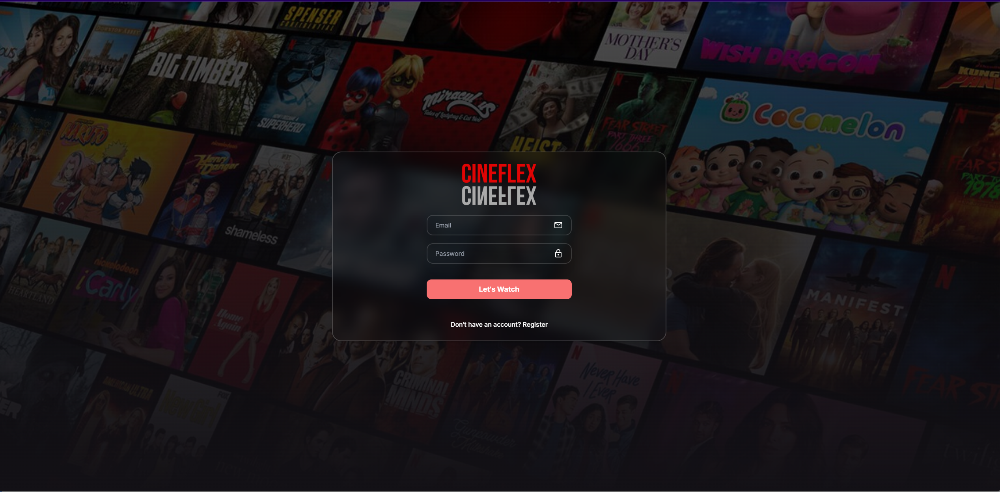
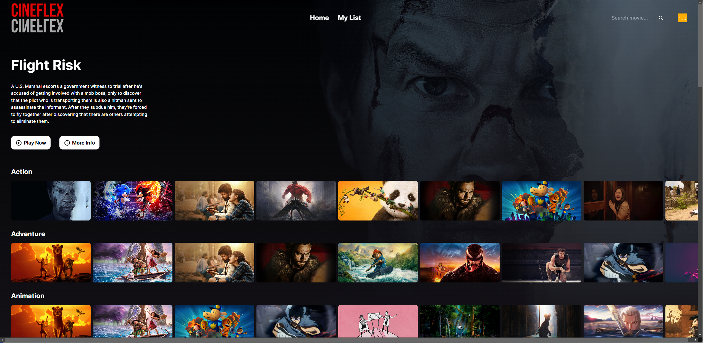
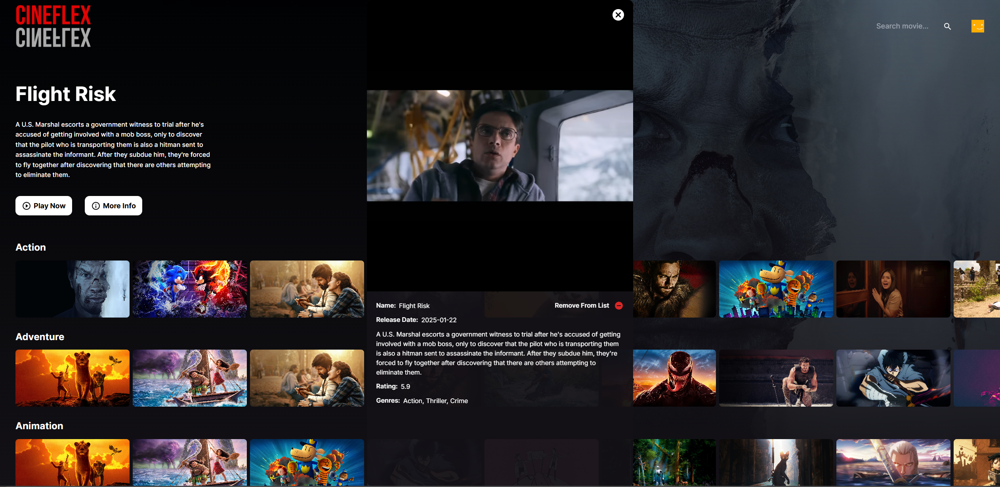
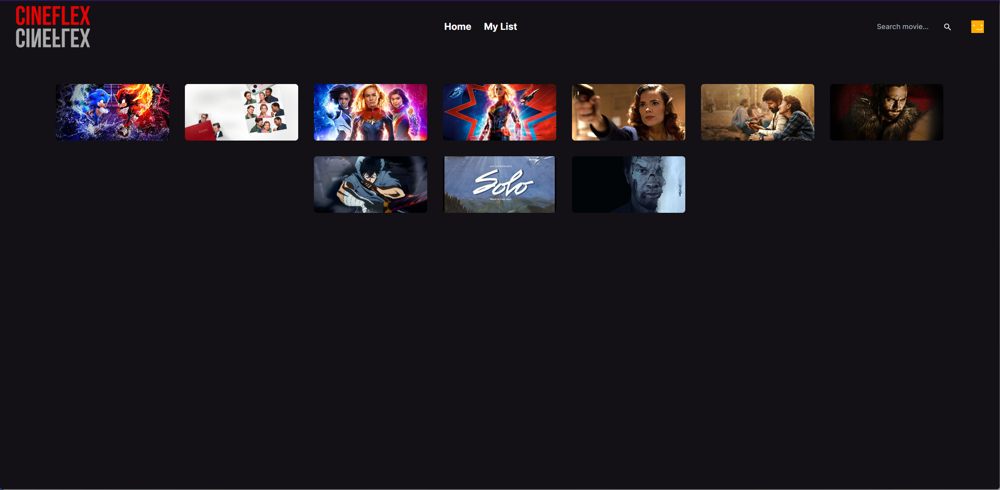

# 🎬 CineFlex - Movie Streaming Platform

## 🌟 Demo

Experience the application live at: [CineFlex Demo](https://vmai-cineflex-beta.vercel.app/)

## 📸 Screenshots

### 🔐 Authentication

*Secure login interface with email and password authentication*

*User-friendly registration page for new account creation*

### 🏠 Main Interface

*The CineFlex homepage featuring trending movies and personalized recommendations*

*Detailed movie information page with synopsis, cast, and trailer*

*Personal watchlist where users can manage their favorite movies*

## ✨ Features

- 🔒 **User Authentication**: Secure login and registration system
- 🎥 **Movie Browsing**: Browse through different categories of movies
- 🔍 **Search Functionality**: Search for specific movies
- ❤️ **Favorites Management**: Add/remove movies to your personal list
- ℹ️ **Movie Details**: View detailed information about movies including trailers
- 📱 **Responsive Design**: Optimized for both desktop and mobile viewing

## 🛠️ Tech Stack

- 🔷 **Frontend**: Next.js 15, React 19, TypeScript
- 🎨 **Styling**: Tailwind CSS
- 🔑 **Authentication**: NextAuth.js
- 🗄️ **Database**: MongoDB with Mongoose
- 🎯 **UI Components**: Material-UI Icons
- 📝 **Form Handling**: React Hook Form
- 🔔 **Notifications**: React Hot Toast
- 🎬 **Movie Data**: TMDB (The Movie Database) API

## 🚀 Getting Started

### Prerequisites

- 📦 Node.js (Latest LTS version recommended)
- 🗃️ MongoDB database

## 📁 Project Structure

- `/actions` - Server actions and API calls
- `/app` - Next.js app router pages and layouts
- `/components` - Reusable React components
- `/context` - React context providers
- `/lib` - Utility functions and type definitions
- `/models` - MongoDB schema models
- `/public` - Static assets

## 🌐 Deployment

The application can be easily deployed on [Vercel Platform](https://vercel.com/new?utm_medium=default-template&filter=next.js&utm_source=create-next-app&utm_campaign=create-next-app-readme), the creators of Next.js.

Check out the [Next.js deployment documentation](https://nextjs.org/docs/app/building-your-application/deploying) for more details.

## 📚 Learn More

To learn more about the technologies used in this project:

- [Next.js Documentation](https://nextjs.org/docs)
- [React Documentation](https://reactjs.org/)
- [Tailwind CSS Documentation](https://tailwindcss.com/docs)
- [NextAuth.js Documentation](https://next-auth.js.org/)
- [MongoDB Documentation](https://docs.mongodb.com/)
- [TMDB API Documentation](https://developer.themoviedb.org/docs/getting-started)
